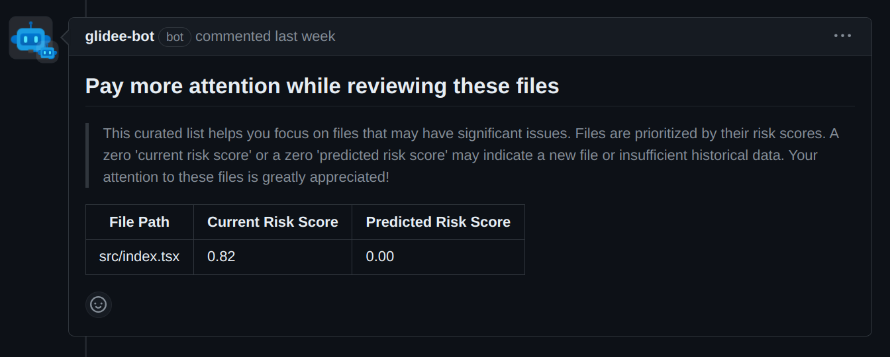
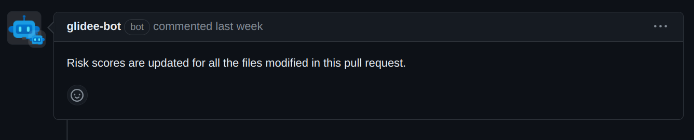

# Your AI assistant in code reviews

Glidee-bot helps developers save time and effort while doing code reviews. It provides a curated list of files with `current` and `predicted` risk scores arranged in order of decreasing risk whenever a new pull request is opened.

### How Glidee-bot works?

- A risk score is given to each file in a repository based on its probability of having bugs in the future. Glidee-bot calculates a `current` risk score based on an algorithm.

- The algorithm determines the score by looking at the commit history and commit recency. For example- a file modified with 10 bug fixes a week ago will score more as compared to a file modified with 2 bug fixes 2 months ago.

- Glidee-bot uses the commit history of a repository to train an AI model to predict the risk score of a file and displays `predicted` risks score along with the `current` score.

- Glidee-bot recalculates and updates the risk scores for all the files in real-time. The current and predicted risk scores are updated whenever a pull request is closed

## See Glidee-bot in action!

**Glidee-bot adds this comment whenever a new pull request is opened**



**Glidee-bot adds this comment, whenever a pull request is closed**



## Setup

```sh
# Install dependencies
npm install

# Run the bot
npm start
or
npm run dev
```

## Docker

```sh
# 1. Build container
docker build -t glide-bot .

# 2. Start container
docker run -e APP_ID=<app-id> -e PRIVATE_KEY=<pem-value> glide-bot
```

## Contributing

If you have suggestions for how glide could be improved, or want to report a bug, open an issue! We'd love all and any contributions.

For more, check out the [Contributing Guide](CONTRIBUTING.md).

## License

[ISC](LICENSE) © 2023 vishesh-baghel
